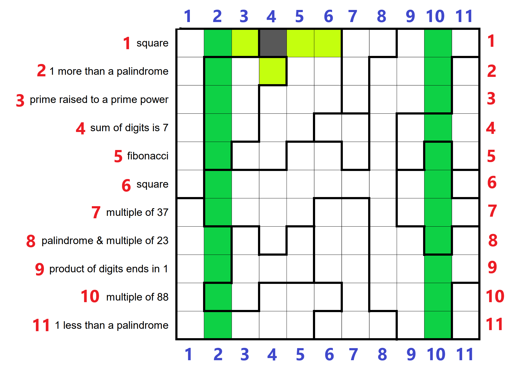
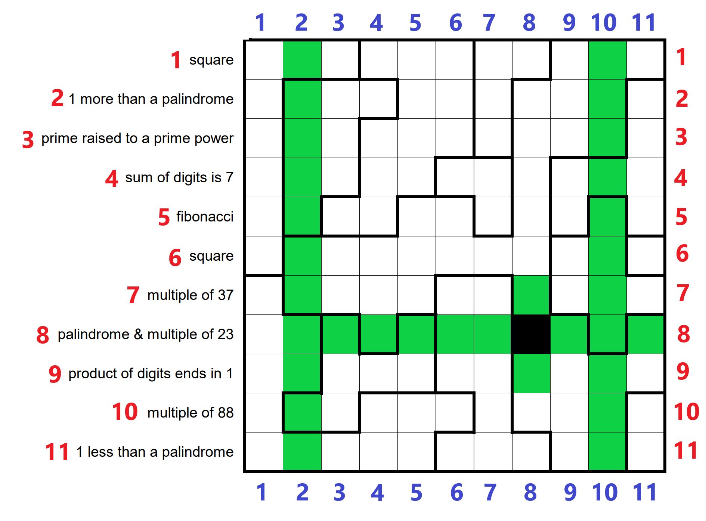
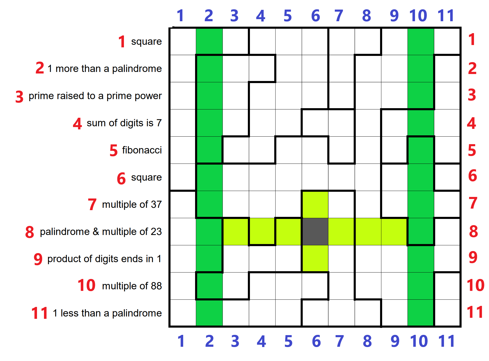
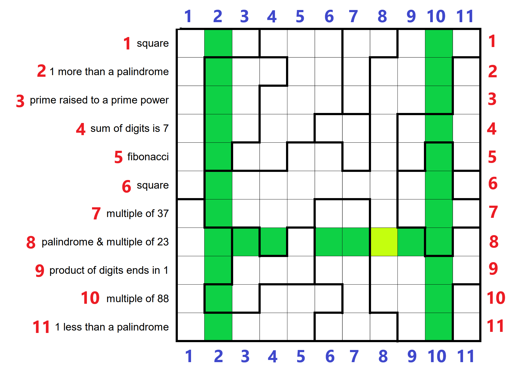
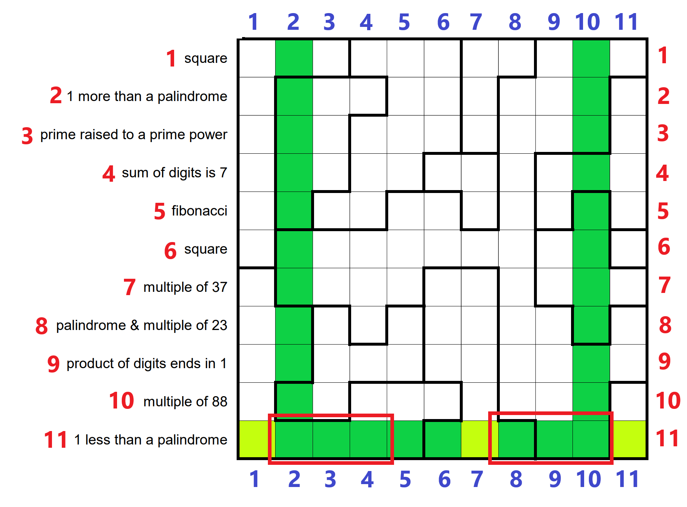

.# Problème original

## Énoncé

The 11-by-11 grid above has been divided into various regions. Shade some of the cells black, then place digits (0-9) into the remaining cells. Shading must be “sparse”: that is, no two shaded cells may share an edge.

Every cell within a region must contain the same digit, arthogonally adjacent cells in different regions must have different digits. (Note that shading cells may break up regions or change which pairs of regions are adjacent. See the example, below.)

Each row has been supplied with a clue. _Every_ number formed by concatenating consecutive groups of unshaded cells within a row must satisfy the clue given for the row. (As in the example.) Numbers must be at least **two digits long** and may not begin with a 0.

The answer to this month’s puzzle is the sum of all the numbers formed in the completed grid. (As in the example.)

## Grille + exemple

![[number-cross-4-updated.png]]

## Grille originale

![[Pasted image 20240714114204.png]]

# Grille annotée 

## Numéros lignes 

![[Pasted image 20240714120403.png]]

## Numéros lignes & colonnes 
![[Pasted image 20240714120821.png]]

# Etat actuel

## Sans chiffres

## Avec chiffres

# Carrés noirs

## Colonne 2 et 10

![[Pasted image 20240714114316.png]]

Impossible d'en mettre dans la zone rouge, car il faut des nombres d'au moins 2 chiffres.

## Ligne 1 (square)

### Case (1, 3)

Même raisonnement que (1, 9)

### Case (1, 9)

Il faudrait un carré à 2 chiffres identiques.
Or les carrés à 2 chiffres sont 16, 25, 36, 49, 64, 81.

Donc cette case ne peut être noire.

### Case (1, 4)

Supposons la case noire

à gauche il faudrait soit un carré de la forme aa, soit de la forme aaa

Or il n'en existe aucun

donc (1, 4) est blanche

### Case (1, 8)

cf (1, 4)

donc (1, 8) est blanche

### Carrés de la forme abb

100, 400, 900, 144, 

### Carrés de la forme aab

225, 441, 

## Ligne 2 (1 more than a palindrome)

### Exemples

Attention 1000 = 999 + 1, 999 étant un palindrome

## Ligne 4 (sum of digits is 7)

### chiffres 8 et 9

On ne peut pas avoir les chiffres 8 ou 9 sur cette ligne

de même pour les cases (2, 2) à (5, 2) du coup, vu qu'elles partagent une zone blanche en commun

### Case (4, 8)

cf (4,9)

soit 2x = 7
soit 3x = 7
aucune solution entière pour x

### Case (4, 9)

Il faudrait un nombre à 2 chiffres identiques dont la somme vaut 7.
Or $7 / 2 = 3.5$ donc ce n'est pas possible.

Donc cette case ne peut pas être noire.

## Ligne 5 (Fibonacci)

### Premiers

liste complète 

<https://r-knott.surrey.ac.uk/Fibonacci/fibtable.html>

de 0 à 40 ici : (ceux non inclus ici intéressants : 40 à 54 sur le site pour longueur 11 max)

- 0
- 1
- 1
- 2
- 3
- 5
- 8
- 13
- 21
- 34
- 55
- 89
- 144
- 233
- 377
- 610
- 987
- 1597
- 2584
- 4181
- 6765
- 10946
- 17711
- 28657
- 46368
- 75025
- 121393
- 196418
- 317811
- 514229
- 832040
- 1346269
- 2178309
- 3524578
- 5702887
- 9227465
- 14930352
- 24157817
- 39088169
- 63245986
- 102334155

#### qui finissent par 6

- 10946
- 63245986

#### qui finissent par 8

- 8
- 46368
- 196418
- 3524578

## Ligne 7 (multiple 37)

### Premiers multiples de 37

#### Longueur 2

- 37
- 74

#### Longueur 3

- 111
- 148
- 185
- 222
- 259
- 296
- 333
- 370
- 407
- 444
- 481
- 518
- 555
- 592
- 629
- 666
- 703
- 740
- 777
- 814
- 851
- 888
- 925
- 962
- 999

### Case (7, 4)

Supposons la case noire

Soit (7, 1) est noire

Mais aucun multiple de 37 de longueur 2 est composé de 2 fois le même chiffre

donc (7, 1) serait blanche

et il n'y a aucun nombre de la forme a bb multiple de 37 (cf la table des multiples de longueur 3 plus haut)

donc (7, 4) est blanche

### Case (7, 8)

(8, 8) est noire

### Case (7, 9)

Si cette case est noire, alors on devrait avoir un multiple de 37 de longueur 2 avec 2 fois le même chiffre, or les premiers multiples sont 37, 74, 111.

Donc cette case ne peut être noire.

- longueur 2 à droite avec **même** chiffre => 37 et 74 sont les seuls de longueur 2 et ne valident pas le critère même chiffre
- ne peut pas être noire

## Ligne 8 (multiple de 23 palindrome)

Le plus petit palindrome multiple de 23 est 161, de longueur 3. Donc les nombres de la ligne 8 sont de longueur 3 minimum, donc les colonnes 3 et 9 de la ligne 8 sont blanches.

- Longueur 3 minimum
- 

![[Pasted image 20240714180014.png]]
![[Pasted image 20240715092239.png]]

### Couleurs 

#### Cases blanches

- 1
- 2
- 3
- 4
- 5
- 6
- 7
- 9
- 10
- 11

#### Cases noires

- 8

### Premiers

- 161
- 414
- 575
- 828
- 989
- 1771
- 4554
- 7337

longueur 7 avec la forme attendue :

- 3375733
- 7714177
- 7796977
- 9970799

### Case (8, 1)

la résolution ici dépend de toutes les autres cases de la ligne 8

supposons (8, 1) noire

(8, 1) ne peut être noire sinon la structure de palindrome est invalide

donc (8, 1) est blanche

### Case (8, 3)

- ne respecte pas longueur 3 minimum
- ne peut pas être noire

### Case (8, 4)

- ne respecterait pas la structure de palindrome pour le nombre à gauche
- ne peut pas être noire

### Case (8, 5)

(8, 8) est noire, et le plus petit nombre compatible est de taille 3

### Case (8, 6)

2 cas :

(8, 1) noir

les seules possibilités sont :

- 1771
- 4554
- 7337

Aucune ne correspond au motif.

Examinons le cas où (8, 1) est blanc

de la forme aa b c d, ne peut pas être un palindrome

Donc (8, 6) est blanche.

### Case (8, 7)

Soit (8, 11) est noire

de la forme aa b, ne peut pas être un palindrome

Soit (8, 11) est blanche

de la forme aa b c, ne peut pas être un palindrome

donc (8, 7) est blanche

### Case (8, 8)

Dépendance aux colonnes :

- 2
- 3
- 4
- 6
- 7
- 9
- 10

Supposons que (8, 8) est blanche (déjà essayé de supposer qu'elle était noire, pas de contradiction)

soit (8, 5) est noire

de la forme aa bb c, ou aa bb c d en fonction de la couleur de (8, 11)

Dans les deux cas, aa bb c et aa bb c d ne sont pas des formes de palindromes valides

donc (8 ,8) blanche => (8, 5) blanche

soit (8, 1) blanche

prenons cette portion

de la forme aa b c

si (8, 11) est blanche

de la forme cc b a, donc pas compatible avec aa b c => pas possible de faire un palindrome

donc (8, 11) ne peut pas être blanche

essayons avec (8, 11) noire

la ligne finit par un motif avec deux chiffres différents, donc incompatible avec le début de la ligne qui commence par 2 chiffres identiques, pour avoir un palindrome

donc (8, 8) est noire

### Case (8, 9)

- ne respecte pas longueur 3 minimum
- ne peut pas être noire

### Case (8, 11)

(8, 8) est noire, et le plus petit nombre compatible est de taille 3

### Todo 

Utiliser les zones de contact avec le même nombre

(8, 7)
![[Pasted image 20240715100648.png]]

## Ligne 9 (produit des chiffres finit en 1)

- Ne peut être que 1, 3, 7, 9 

Longueur 2 de mêmes chiffres :

- 11
- 99

Longueur 3 :

- 

### Case (9, 8)

(8, 8) est noire, et le plus petit nombre compatible est de taille 3

## Ligne 10 (multiple de 88)

![[Pasted image 20240715092315.png]]

### Premiers multiples

#### Longueur 2

- 88

#### Longueur 3

- 176
- 264
- 352
- 440
- 528
- 616
- 704
- 792
- 880
- 968

### Case (10, 3)

Le plus petit multiple de 88 est 88, puis le deuxième est 176, de longueur 3.

Si on noircit cette case :
![[Pasted image 20240714180339.png]]

alors il reste 2 cases à gauche, donc il faudrait mettre un multiple de 88 de longueur 2 dedans. Le seul étant 88, et les zones étant connexes, on arrive à une impossibilité.

![[Pasted image 20240714180534.png]]

Cette case ne peut pas être noire.

### Case (10, 7)

Aucun multiple de 88 n'est de la forme aaab avec a = 1 ou a = 9

donc (10, 7 est blanche)

### Case (10, 8)

Supposons la case noire

aucun multiple de 88 de longueur 3 ne commence par "11" ou "99"

donc (10, 8) est blanche

### Case (10, 9)

Même raisonnement que la case (10, 3).

![[Pasted image 20240714180630.png]]

Cette case ne peut pas être noire.

### Case (10, 11)

Supposons (10, 11) noire

Utilisons les cases (8, 9) à (8, 11)

Il ne peut y avoir que 161 et 989 (forme aba et 1 3 7 9 de la ligne 9)

on aurait alors un multiple de 88 qui finit par 1 ou 9

sachant que 88 = 44 x 2, on aurait un multiple de 2 qui finit par 1 ou 9 => contradiction

Donc (10, 11) est blanche

### Case (10, 4)

Cette case est-elle noire ? 

![[Pasted image 20240714182148.png]]

1) Il existe un multiple de 88 de longueur 3, finissant par 2 fois le même nombre
2) Il n'y en a pas
    a) Soit 88 dans les cases vertes et la première case est noire
    b) Soit (10, 4) n'est pas noire

Le 1) est faux (cf les premiers multiples ci-dessus).

DONC 
- soit (10, 4) est blanche
- soit (10, 4) et (10, 1) sont noires, et les cases vertes contiennent 88
![[Pasted image 20240714182556.png]]

### Case (10, 7)

Cette case est-elle noire ? 

![[Pasted image 20240714181848.png]]

S'il n'existe aucun multiple de 88 finissant par 3 fois le même nombre, de longueur 5 ou 6, alors cette case ne peut pas être noire.

## Ligne 11 (1 less than a palindrome)

à revoir en fait... je n'ai pas pris en compte si on noircissait (11, 1)
![[Pasted image 20240715094550.png]]

==> en fait si je pense que c'est bon

![[Pasted image 20240715100003.png]]

### Case (11, 3)

Supposons la case noire

Il nous faudrait 1 de moins qu'un palindrome, de longueur 2, avec 2 chiffres égaux... On a une contradiction.

(11, 3) est blanche

### Case (11, 4)

Il nous faudrait 1 de moins qu'un palindrome, de longueur 3, avec 3 chiffres égaux, contradiction.

Ou alors de longueur 2 si on suppose (11, 1) noire. Cela revient au même, impossible

(11, 4) est blanche

### Case (11, 5)

palindrome - 1 de longueur 3 ou 4, avec tous les chiffres identiques

impossible

(11, 5) est blanche

### Case (11, 6)

Supposons (11, 6) noire

Soit (11, 1) est noire, soit (11, 3) est noire (ou exclusif)

(11, 3) noire

palindrome - 1 de longueur 2 de la forme aa, impossible

(11, 1) noire

palindrome - 1 de la forme aaaa, impossible

(11, 6) est blanche

### Case (11, 8)

Dépendances
- de (11, 3) à (11, 5) blanches

Supposons (11, 8) noire

de 1 à 7

ou de 2 à 7

on aurait une structure

aaaa bb ou aaaaa bb, les palindromes sous-jacents seraient aaaa ba ou aaaaa ba

dans les deux cas, ce n'est pas une forme de palindrome valide

donc (11, 8) est blanche

### Case (11, 7)

dépendances :
- (11, 2) à (11, 10) sauf (11, 7)

Elle pourrait être noire (les deux côtés en résultant donnent des positions valides)

Supposons (11, 7) blanche

4 cas :

1) (11, 1) blanche et (11, 11) blanche
2) (11, 1) blanche et (11, 11) noire
3) (11, 1) noire et (11, 11) blanche
4) (11, 1) noire et (11, 11) noire

#### cas 1, (11, 1) blanche et (11, 11) blanche

structure de palindrome impossible

#### cas 2, (11, 1) blanche et (11, 11) noire

structure de palindrome impossible

#### cas 3, (11, 1) noire et (11, 11) blanche

structure de palindrome impossible

#### cas 4, (11, 1) noire et (11, 11) noire

structure de palindrome impossible

Aucun cas ne marche, donc (11, 7) est noire

### Case (11, 9)

dépendances :
- (11, 3) à (11, 6), et (11, 8)

Supposons (11, 9) noire

de 1 à 8 ou de 2 à 8 on a 5a 3b ou 4a 3b

palindromes sous-jacents 5a 2b a ou 4a 2b a

pas une forme de palindrome valide

donc (11, 9) est blanche

## Maximum de carrés noirs

On ne peut pas avoir plus de 4 carrés noirs dans une ligne, du fait qu'il doit y avoir au moins 2 chiffres d'affilée

 Donc, il y a 4 chiffres max à trouver par ligne

Exemple :
![[Pasted image 20240714115851.png]]

## Idées

- lister toutes les possibilités de motifs de carrés noirs

# Zones définitives

Zones qui auront le même nombre, quoi qu'il arrive (à cause de l'impossibilité de mettre des carrés noirs)

# Palindromes

# Random

vu qu'il y a 4 carrés noirs max il y a 4 chiffres max à trouver par ligne non ?

# Ligne par ligne

## 2 - 1 more than a palindrome

### Exemples

#### Longueur 2

12
23
34
45
56
67
78
89

## 9 - Product of digits ends with 1

Pas de
- 0 car le produit finit par 1
- 2 sinon ça finit par un nombre pair
- 4 (pareil que 2)
- 5 sinon ça finit par 0 ou 5
- 6 (pareil que 2)
- 8 (pareil que 2)

**Possibilités : 1, 3, 7, 9**

### Influence

Dans la zone violette => 1, 3, 7, 9
![[Pasted image 20240714125822.png]]
![[Pasted image 20240714183642.png]]

## 11 - 1 less than a palindrome

### Exemples

#### Longueur 2

10
21
32
43
54
65
76
87
98

#### Longueur 3

Palindromes 111, 121, ...
- 110
- 120
- 130
- ...
- 190

Palindromes 
0 4 5 6 7 10

donc
1 5 6 7 8 11

donc
2 3 4 9 10

# Cases forcément blanches

D'après le solver d'Antoine

possibilités noires ligne 8 : 0 4 7 10 => 1 5 8 11
donc cases blanches : 2 3 4 6 7 9 10

- soit ça : (cases noires : 1 / 5 / 11)
161 989
13731 37973

- soit la case 7:
autres possibilités (voir solver)
