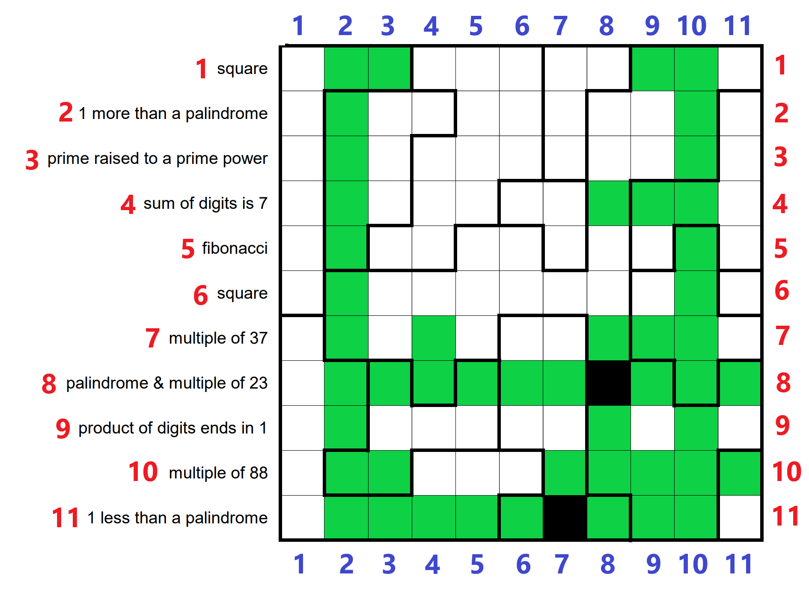

# Etat actuel

## Sans chiffres

## Avec chiffres

## Pistes

- 1,4 et 1,8 car il n'y a aucun carré qui a 2 ou 3 fois le même chiffre de longueur 2 ou 3 respectivement
- Regarder 6,3 6,4 6,8 et 6,9
- 11,11 => en fait si c'était 1 en 11,9 et 11,10, on ne pourrait pas décider de si la case (11, 11) est noire ou blanche
  - or, on nous promet une solution unique, donc on est contraint de choisir 9 en case (11, 9) et (11, 10), pour ne pas aboutir à une impasse
- 
