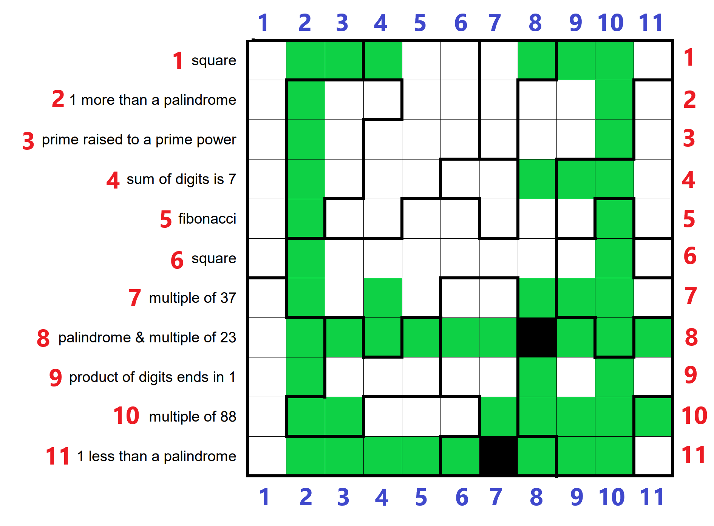
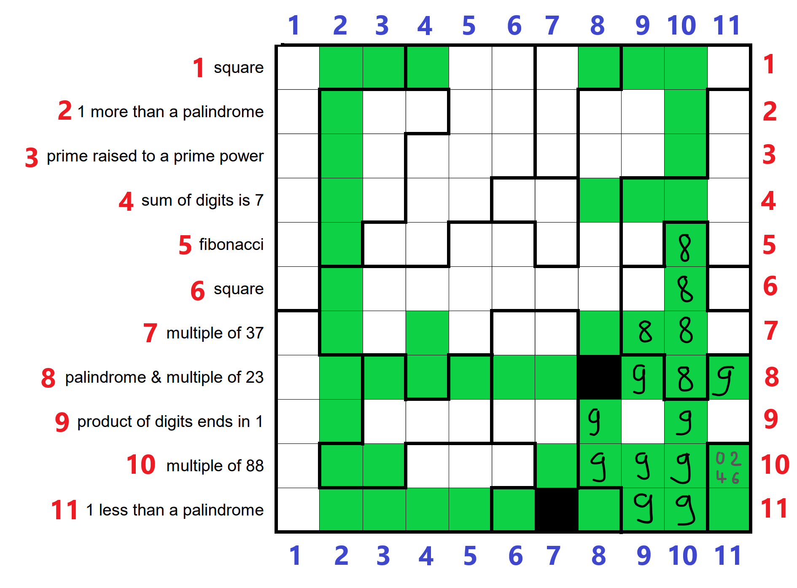

# Etat actuel

## Sans chiffres

## Avec chiffres

## Pistes

- Regarder 6,3 6,4 6,8 et 6,9
- rédiger proprement (11, 11)
- voir conséquences de (11, 11) blanche
  - (10, 10) ne peut avoir 8, sinon ça forcerait 9998 en bas, incompatible avec la structure de zones
- 
